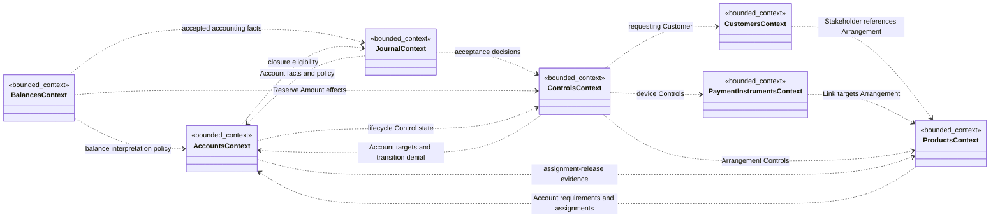

# Domain Model Index

> [!info] Snapshot
> **Date:** 2026-07-11
> No application code or implemented domain-model types exist in this repository as of this snapshot. These notes and diagrams describe documented concepts, relationships, decisions, and open questions only.

## Context Model Notes

- [[contexts/accounts/Accounts Model|Accounts Model]] — Account identity, bounds policy, immutable accounting properties, and lifecycle.
- [[contexts/journal/Journal Model|Journal Model]] — Ledgers, indivisible Transactions, Transaction-owned Postings, resolution, accounting time, and authoritative acceptance.
- [[contexts/balances/Balances Model|Balances Model]] — rebuildable current and historical balance and directional-capacity queries.
- [[contexts/products/Products Model|Products Model]] — versioned Product Definitions, opened Product Arrangements, and their Ledger Account assignments.
- [[contexts/customers/Customers Model|Customers Model]] — Customer identity and Stakeholder relationships to Product Arrangements.
- [[contexts/payment-instruments/Payment Instruments Model|Payment Instruments Model]] — Payment Devices and immutable Links to Product Arrangements.
- [[contexts/controls/Controls Model|Controls Model]] — auditable Controls on Product Arrangements, Accounts, and Payment Devices.
- [[specs/001-ledger-service/Audit And Command Model|Audit And Command Model]] — a draft, unassigned conceptual model for actors, command requests, audit causality, CQRS, and event sourcing.

## Bounded Context Dependencies

The arrows show documented reference, projection, or enforcement dependencies, not storage ownership, call direction, deployment boundaries, aggregate boundaries, or event-stream topology. Accounts and Journal deliberately have cyclic coordination around authoritative Transaction acceptance and Account closure; Balances never supplies authorization evidence.

## Source Authority: Canonical Versus Draft

- [[CONTEXT-MAP|Context Map]] is canonical for bounded-context ownership and relationships.
- [[SHARED-LANGUAGE|Shared Language]] is canonical for cross-context Organization, operation-ordering, operation-identity, and Ledger Primitive terms.
- Each context's `CONTEXT.md` is canonical for its ubiquitous language. Accepted system and context ADRs are canonical for the decisions they record.
- The context `Model.md` notes and this index are derived navigation and visualization aids. They must not silently override a context glossary or accepted ADR.
- [[specs/001-ledger-service/spec|Ledger Service Feature Specification]] is a draft requirements source. Its Actor, Command Request, Action Record, State Change Record, and Change Set concepts are not yet assigned to a bounded context.
- [[docs/adr/0009-use-cqrs-and-event-sourced-write-models|ADR 0009]] is authoritative for CQRS, event-sourced write models, authoritative Domain Events, rebuildable read models, and derived audit representations. It does not settle exact stream and consistency-boundary topology.
- [[docs/adr/0014-split-ledger-into-accounting-contexts|ADR 0014]] is authoritative for splitting the former Ledger boundary into Accounts, Journal, and Balances.
- If a derived model note or draft specification conflicts with canonical language or an accepted decision, follow the canonical source and record the drift for resolution.

## Related

- [[CONTEXT-MAP|Context Map]]
- [[SHARED-LANGUAGE|Shared Language]]
- [[specs/001-ledger-service/spec|Ledger Service Feature Specification]]
- [[docs/adr/0009-use-cqrs-and-event-sourced-write-models|ADR 0009 — Use CQRS and Event-Sourced Write Models]]
- [[docs/adr/0014-split-ledger-into-accounting-contexts|ADR 0014 — Split Ledger into Accounting Contexts]]
