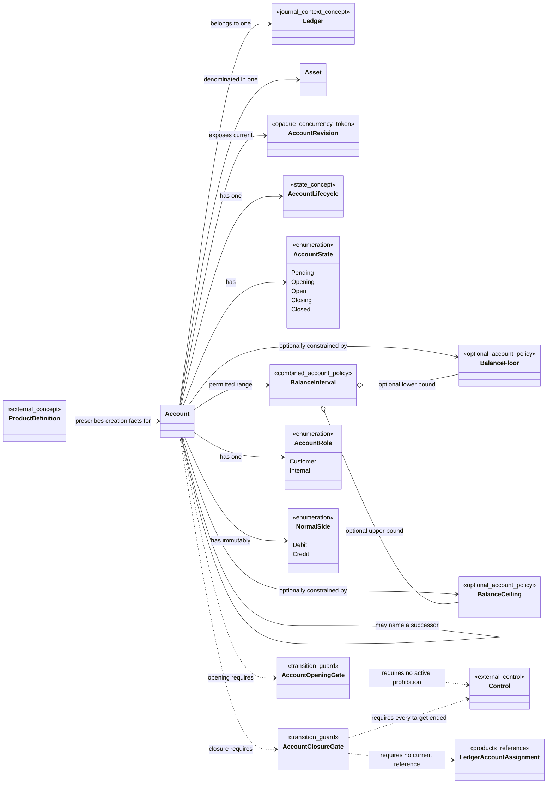

# Accounts Model

> Conceptual bounded-context model — not yet implemented

This note is a reference view of the Accounts bounded context. The canonical language remains in [[contexts/accounts/CONTEXT|Accounts Context]], and accepted Accounts ADRs remain authoritative for its decisions.

## Class Diagram

The closure dependencies express required authoritative evidence, not ownership or a synchronous call graph. Their consistency mechanism remains open. The Account self-link is predecessor-to-successor navigation and never reopens the predecessor.

## Asset

The fixed-precision denomination in which quantities are recorded, including fiat currencies, tokens, securities, and reward units. An [[Accounts Model#Account|Account]] has exactly one immutable Asset.

## Account

A named record of quantities of one [[Accounts Model#Asset|Asset]] within one [[contexts/journal/Journal Model#Ledger|Ledger]]. Its Asset, [[Accounts Model#Account Role|Account Role]], and [[Accounts Model#Normal Side|Normal Side]] are immutable. It may have optional [[Accounts Model#Balance Floor|Balance Floor]] and [[Accounts Model#Balance Ceiling|Balance Ceiling]] policies and exposes its current Account Revision. It is not a balance, Product Arrangement, or Customer relationship.

## Account Revision

The opaque Accounts-owned concurrency token for one authoritative version of an Account's identity, lifecycle, and policy facts. It advances whenever any authoritative Account fact changes. Journal records and fences against evaluated revisions; clients do not construct or increment them.

## Account Lifecycle

The existence state of an [[Accounts Model#Account|Account]] from creation in Pending through staged opening, operation, and permanent closure. Temporary operational prohibitions are Controls and do not become lifecycle states.

## Account State

The Account lifecycle phase: Pending, Opening, Open, Closing, or terminal Closed. A new Account starts Pending, moves to Opening when opening work begins, becomes Open only through the Account Opening Gate, and moves through Closing before Closed.

Pending precedes and rejects opening work as well as ordinary Transactions. Opening allows only explicitly authorized opening work and still rejects ordinary Transactions. Closing rejects new ordinary Transactions and Ledger Account Assignments while allowing accepted Pending Transactions, authorized closure activity, and corrections to finish; Closed never returns to another state.

## Account Opening Gate

The conditions required to move an Opening Account to Open: required opening work is complete and no Active applicable Control prohibits that exact transition. Controls supplies authoritative denials, while Accounts owns and performs the transition; ending a Control never opens the Account automatically.

## Account Closure Gate

The conditions required to move a Closing Account to Closed: its authoritative posted position is exactly zero, no Pending or Continuation Transactions remain, every targeting Control is Ended by its own authority, and no current Ledger Account Assignment references the Account. Closure clears balances through explicit authorized Transactions and never ends a Control or removes an Assignment implicitly.

Closure is an Accounts lifecycle decision, but the gate depends on authoritative Journal position and commitment state plus Controls and Products evidence. Balances may present the same derived position, but a possibly stale Balance Snapshot is insufficient evidence.

## Successor Account

A later Account linked to a Closed predecessor for navigation and audit continuity. It follows the normal Pending-to-Open lifecycle and neither reopens the predecessor nor migrates historical activity.

## Account Role

The Account's descriptive relationship to the Organization's product: Customer or Internal. It identifies neither a Customer nor a Stakeholder and does not determine Normal Side or valid Transaction participation.

## Normal Side

The immutable [[contexts/journal/Journal Model#Posting|Posting]] side that increases an Account's natural balance: Debit or Credit. Both sides may affect the Account; a Product Definition prescribes Normal Side when the Account is created, and it remains independent of [[Accounts Model#Account Role|Account Role]].

## Balance Floor

The optional lowest natural-sign position an Account may reach through balance-consuming Transactions. Zero prevents overdraft, a negative value enables credit capacity, and absence means the Account is unconstrained.

Balance Floor is authoritative Account policy. [[contexts/balances/Balances Model#Decrease Capacity|Decrease Capacity]] reports the room implied by that policy, while [[contexts/journal/Journal Model#Availability Check|Availability Check]] enforces it during Transaction acceptance.

## Balance Ceiling

The optional highest natural-sign position an Account may reach through exposure-increasing Transactions. A positive ceiling limits the growth of debit-normal loan or card receivable exposure, while absence means no upper bound.

Balance Ceiling is authoritative Account policy. [[contexts/balances/Balances Model#Increase Capacity|Increase Capacity]] reports the room implied by that policy, while [[contexts/journal/Journal Model#Availability Check|Availability Check]] enforces it during Transaction acceptance.

## Balance Interval

The permitted natural-sign range formed by an Account's optional Balance Floor and Balance Ceiling. Either bound may be absent, but when both exist the Floor cannot exceed the Ceiling; Journal enforces the complete interval atomically during Transaction acceptance.

## Balance Ceiling Change

An audited change to an Account's Balance Ceiling that takes effect at its immutable Ledger Position in the Account operation order. Its service-assigned Recorded At cannot be backdated or future-dated, and tightening never rewrites existing exposure or invalidates an accepted Pending Transaction.

## Balance Floor Change

An audited change to an Account's Balance Floor that takes effect at its immutable Ledger Position in the Account operation order. Its service-assigned Recorded At cannot be backdated or future-dated, and tightening never rewrites existing exposure or invalidates an accepted Pending Transaction.

## Cross-Context Coordination

- Products defines Account creation rules; Accounts enforces its own invariants without learning Product Definition or Product Arrangement semantics.
- Journal evaluates Account membership, Asset, Normal Side, lifecycle state, Balance Interval, and current bound-change state at a specific Account Revision. Accounts supplies the current revision for Journal's all-or-nothing commit fence.
- Balances uses Asset, Normal Side, and Account bounds to interpret accepted Journal activity; it does not own or mutate those Account facts.
- Controls owns Controls, and Products owns Ledger Account Assignments. Account opening and closure observe their authoritative outcomes without creating, ending, or removing them.

## Invariants

- Every Account belongs to exactly one Ledger and has exactly one immutable Asset, Account Role, and Normal Side.
- Every Account exposes one current Account Revision, which advances on every authoritative Account change.
- Account State progresses from Pending through Opening, Open, and Closing to Closed. Temporary Controls do not replace this lifecycle.
- Pending Accounts precede and reject opening work; Opening Accounts allow only explicitly authorized opening work, and both reject ordinary Transactions.
- Opening-to-Open requires the Account Opening Gate, including the absence of an Active Control that prohibits the transition.
- Ending an Account Opening Block removes a denial but never transitions the Account automatically.
- Closing rejects new ordinary Transactions and Ledger Account Assignments but permits existing commitments and authorized closure or correction work to finish.
- A Closing Account reaches Closed only when Journal supplies authoritative zero-position and no-commitment eligibility, every targeting Control is Ended by its own authority, and no current Ledger Account Assignment remains; clearing activity is explicit Journal activity.
- Closed is terminal. A Successor Account supplies continuity without reopening its predecessor or moving historical activity.
- Balance Floor and Balance Ceiling are Account policies, not balance projections and not inferences from Account Role; when both exist, Floor cannot exceed Ceiling.
- Bound changes take effect in Ledger Position order; Recorded At is wall-clock metadata and never orders them.
- Neither Account Role nor an Account record establishes Customer identity, Stakeholder semantics, or Product ownership.

## Unresolved Questions and Overstatement Risks

- The exact catalogue of authorized closure and correction activity is not specified.
- The exact opening work allowed in Opening is not specified.
- The terminal abandonment or rejection path for an Account that will never reach Open is not yet modeled.
- The identity and ownership rules for standard Assets versus Organization-defined Assets are not yet specified.
- The mechanism that supplies authoritative Account facts to Journal without weakening commit-time invariants is not yet designed.
- The mechanism that proves every Account Closure Gate condition in one valid ordering is not yet designed.
- The mechanism that proves the Account Opening Gate and applicable Controls in one valid ordering is not yet designed.
- Customer Account Role does not establish a relationship to a Customer; [[contexts/customers/Customers Model#Stakeholder|Stakeholder]] does that through the Products context.
- No association in this note implies an aggregate root, storage schema, consistency boundary, deployment boundary, or event-stream topology.

## Related

- [[contexts/journal/Journal Model|Journal Model]]
- [[contexts/balances/Balances Model|Balances Model]]
- [[contexts/accounts/CONTEXT|Accounts Context]]
- [[SHARED-LANGUAGE|Shared Language]]
- [[docs/adr/0014-split-ledger-into-accounting-contexts|Split Ledger into Accounting Contexts]]
- [[docs/adr/0019-separate-ledger-position-from-recorded-time|Separate Ledger Position from Recorded Time]]
- [[docs/adr/0020-fence-journal-commits-with-account-revisions|Fence Journal Commits with Account Revisions]]
- [[docs/adr/0021-co-locate-accounts-and-journal-writes-initially|Co-locate Accounts and Journal Writes Initially]]
- [[docs/adr/0003-model-denominations-as-assets|Model Denominations as Assets]]
- [[docs/adr/0007-model-temporary-account-blocks-as-controls|Model Temporary Account Blocks as Controls]]
- [[docs/adr/0012-route-customer-facing-relationships-through-product-arrangements|Route Customer-Facing Relationships Through Product Arrangements]]
- [[contexts/accounts/docs/adr/0003-use-balance-floors-for-credit-capacity|Use Balance Floors for Credit Capacity]]
- [[contexts/journal/docs/adr/0020-keep-closed-accounts-at-zero-during-corrections|Keep Closed Accounts at Zero During Corrections]]
- [[contexts/accounts/docs/adr/0021-keep-account-role-asset-and-normal-side-immutable|Keep Account Role, Asset, and Normal Side Immutable]]
- [[contexts/accounts/docs/adr/0022-apply-balance-floor-changes-prospectively|Apply Balance Floor Changes Prospectively]]
- [[contexts/accounts/docs/adr/0023-support-balance-ceilings-for-receivable-exposure|Support Balance Ceilings for Receivable Exposure]]
- [[contexts/accounts/docs/adr/0024-apply-balance-ceiling-changes-prospectively|Apply Balance Ceiling Changes Prospectively]]
- [[contexts/accounts/docs/adr/0025-allow-bounded-account-intervals|Allow Bounded Account Intervals]]
- [[contexts/accounts/docs/adr/0018-use-closing-state-to-drain-accounts|Use Closing State to Drain Accounts]]
- [[contexts/accounts/docs/adr/0026-store-normal-side-directly-on-accounts|Store Normal Side Directly on Accounts]]
- [[contexts/accounts/docs/adr/0028-stage-account-opening|Stage Account Opening Through Pending and Opening]]
- [[contexts/products/Products Model|Products Model]]
- [[contexts/customers/Customers Model|Customers Model]]
- [[contexts/payment-instruments/Payment Instruments Model|Payment Instruments Model]]
- [[contexts/controls/Controls Model|Controls Model]]
