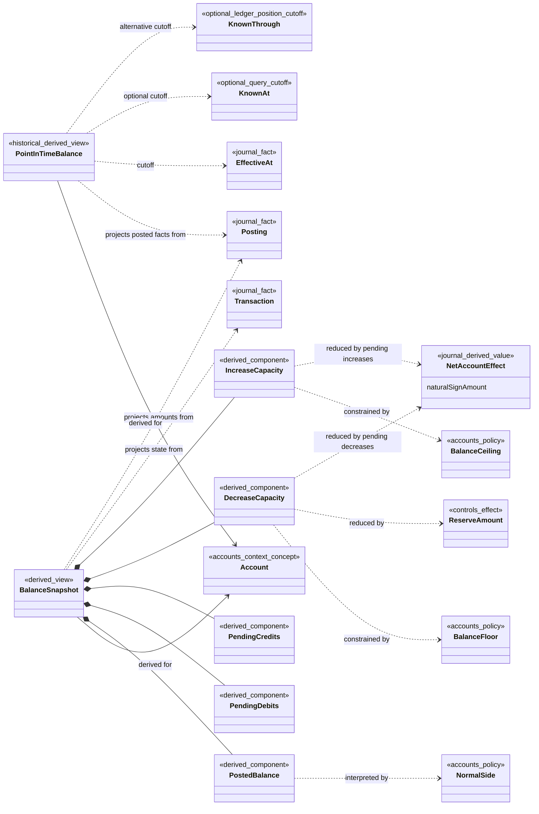

# Balances Model

> Conceptual bounded-context model — not yet implemented

This note is a reference view of the Balances bounded context. The canonical language remains in [[contexts/balances/CONTEXT|Balances Context]], and accepted Balances ADRs remain authoritative for its decisions.

## Class Diagram

The Journal History facts, Account policies, and Control effects shown here are inputs owned by other bounded contexts. Their appearance does not transfer authority to Balances.

## Known At

The optional Recorded At cutoff used by a Point-in-Time Balance to reproduce the information available at a past instant. It includes every fact recorded at or before that instant and applies those facts in Ledger Position order. It is mutually exclusive with Known Through.

## Known Through

The optional Ledger Position cutoff used by a Point-in-Time Balance to reproduce an exact committed prefix of one Ledger. It includes facts at or before that position and is mutually exclusive with Known At. Omitting both knowledge cutoffs means current service knowledge.

## Balance Snapshot

A derived view of one [[contexts/accounts/Accounts Model#Account|Account]] and its current recorded operational state. It groups Posted Balance, Pending Debits, Pending Credits, Decrease Capacity, and Increase Capacity; none is an independently mutable balance bucket.

## Point-in-Time Balance

A historical Posted Balance for one Account constrained by an [[contexts/journal/Journal Model#Effective At|Effective At]] cutoff and at most one knowledge cutoff: [[Balances Model#Known At|Known At]] for a wall-clock view or [[Balances Model#Known Through|Known Through]] for an exact Ledger Position prefix. Omitting both uses current knowledge. Included facts are applied in Ledger Position order, and the result excludes pending totals and directional capacities.

## Posted Balance

The natural-sign position projected only from Postings in Posted Transactions. It is debits minus credits for a Debit-normal Account and credits minus debits for a Credit-normal Account; a negative value is a contrary balance.

## Pending Debits

The gross total of debit Postings for an Account in Pending activity, including Postings that cancel against credits within the same Pending Transaction's Net Account Effect. It is a reporting component of [[Balances Model#Balance Snapshot|Balance Snapshot]], not a separate balance and not the direct input to directional capacity.

## Pending Credits

The gross total of credit Postings for an Account in Pending activity, including Postings that cancel against debits within the same Pending Transaction's Net Account Effect. It is a reporting component of [[Balances Model#Balance Snapshot|Balance Snapshot]], not a separate balance and not the direct input to directional capacity.

## Decrease Capacity

For an Account with a [[contexts/accounts/Accounts Model#Balance Floor|Balance Floor]], the non-negative room remaining for natural-sign decreases after the floor, the aggregate magnitudes of decreasing [[contexts/journal/Journal Model#Net Account Effect|Net Account Effects]] from Pending Transactions, and applicable Reserve Amount effects are deducted from Posted Balance. Increasing effects from distinct Pending Transactions do not offset them or release capacity until Posted. An Account without a Balance Floor has no applicable Decrease Capacity.

## Increase Capacity

For an Account with a [[contexts/accounts/Accounts Model#Balance Ceiling|Balance Ceiling]], the non-negative room remaining for natural-sign increases after Posted Balance and the aggregate magnitudes of increasing [[contexts/journal/Journal Model#Net Account Effect|Net Account Effects]] from Pending Transactions are deducted from the ceiling. Decreasing effects from distinct Pending Transactions do not offset them or release capacity until Posted. An Account without a Balance Ceiling has no applicable Increase Capacity.

Decrease Capacity and Increase Capacity are query projections. [[contexts/journal/Journal Model#Availability Check|Availability Check]] is the authoritative Journal decision that enforces both bounds while accepting a Transaction.

## Projection Interface and Authority

- The Balances interface answers current Balance Snapshot and historical Point-in-Time Balance queries; it accepts no Ledger mutation commands.
- Every view is rebuildable from the Ledger's authoritative Journal History plus the Account and Controls facts needed to interpret it.
- A projection may lag its sources. Query results therefore expose their consistency position and may satisfy a caller-provided minimum position as required by the context's CQRS decision.
- Projection storage may be updated as facts arrive, but those writes create no authoritative Ledger facts or independent balance state changes.

## Invariants

- Posted Balance, pending totals, Decrease Capacity, and Increase Capacity are derived; none is an independently mutable balance bucket.
- Posted Balance uses only Postings in Posted Transactions and applies the Account's immutable Normal Side.
- Pending Debits and Pending Credits are gross Posting totals used for reporting. Directional capacity instead nets opposing Postings within each Transaction into one Net Account Effect, then aggregates independently resolvable Transaction effects gross by direction without offset.
- Balance Snapshot reports current operational state. Point-in-Time Balance reports historical Posted Balance and never mixes in pending totals or directional capacities.
- Point-in-Time Balance uses Effective At for economic history and accepts at most one knowledge cutoff: Known At by Recorded At instant or Known Through by Ledger Position. Omitting both uses current knowledge, and included facts are applied in Ledger Position order.
- Reserve Amount affects Decrease Capacity but not Increase Capacity, while Prohibit Action and Usage Limit remain separate permission decisions.
- Decrease Capacity and Increase Capacity are informative outputs, not permission and not authorization evidence for Transaction acceptance or Account closure.
- Every balance view can be discarded and rebuilt without losing authoritative Ledger history.

## Unresolved Questions and Overstatement Risks

- Whether each balance view is materialized, calculated on demand, or served by multiple adapters is not yet designed.
- The exact projection event contracts and recovery partitions are not yet designed.
- Balance Snapshot is a derived view, not an Account-owned mutable entity and not an ADR 0009 write-side replay snapshot.
- Account closure needs authoritative zero-balance evidence; the mechanism for obtaining it without trusting a stale projection remains open.
- No association in this note implies an aggregate root, storage schema, consistency boundary, deployment boundary, or event-stream topology.

## Related

- [[contexts/accounts/Accounts Model|Accounts Model]]
- [[contexts/journal/Journal Model|Journal Model]]
- [[contexts/balances/CONTEXT|Balances Context]]
- [[SHARED-LANGUAGE|Shared Language]]
- [[docs/adr/0014-split-ledger-into-accounting-contexts|Split Ledger into Accounting Contexts]]
- [[docs/adr/0019-separate-ledger-position-from-recorded-time|Separate Ledger Position from Recorded Time]]
- [[docs/adr/0013-separate-directional-capacity-from-operation-permission|Separate Directional Capacity from Operation Permission]]
- [[docs/adr/0009-use-cqrs-and-event-sourced-write-models|Use CQRS and Event-Sourced Write Models]]
- [[contexts/balances/docs/adr/0001-derive-balance-components-from-postings|Derive Balance Components from Postings]]
- [[contexts/balances/docs/adr/0002-do-not-count-pending-relief-in-directional-capacity|Do Not Count Pending Relief in Directional Capacity]]
- [[contexts/accounts/docs/adr/0003-use-balance-floors-for-credit-capacity|Use Balance Floors for Credit Capacity]]
- [[contexts/journal/docs/adr/0027-net-opposing-postings-within-a-transaction|Net Opposing Postings Within a Transaction]]
- [[contexts/journal/docs/adr/0013-separate-recorded-and-effective-time|Separate Recorded and Effective Time]]
- [[contexts/balances/docs/adr/0014-support-bitemporal-balance-queries|Support Bitemporal Balance Queries]]
- [[contexts/balances/docs/adr/0015-separate-historical-balance-from-operational-snapshot|Separate Historical Balance from Operational Snapshot]]
- [[contexts/controls/Controls Model|Controls Model]]
