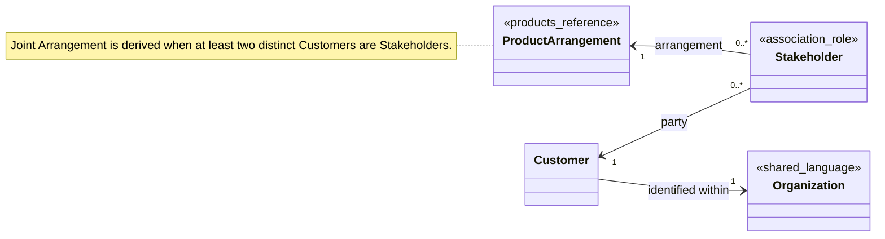

# Customers Model

> Conceptual model — not yet implemented

This note describes the Customers-owned identity and Stakeholder relationship model. Organization and Product Arrangement are external references; the diagram does not claim storage ownership, aggregate boundaries, or event-stream topology.

## Class Diagram

The two Stakeholder associations implement the documented many-to-many relationship between Customers and Product Arrangements. Joint Arrangement is deliberately a derived label on a Product Arrangement, not a class, Ledger Account Role, or Normal Side.

## Customer

A person or organization served and identified within exactly one [[SHARED-LANGUAGE|Organization]] scope. Customer identity is independent of every Product Arrangement and Ledger Account.

## Stakeholder

The Customers-owned association role in which one Customer is a party to one [[contexts/products/Products Model#Product Arrangement|Product Arrangement]] belonging to the same Organization. A Customer may relate to many Product Arrangements, and one Product Arrangement may relate to many distinct Customers.

Stakeholder conveys neither an ownership share nor permission to operate the Product Arrangement or its assigned Ledger Accounts. It is also distinct from the Ledger's descriptive [[contexts/accounts/Accounts Model#Account Role|Account Role]].

## Joint Arrangement

A Product Arrangement for which at least two distinct Customers are Stakeholders. Jointness is derived from the current Stakeholder relationships and is not a separate entity, Ledger Account type, Account Role, or Normal Side. Customer-facing copy may call it a joint account, but that wording is not the canonical domain term.

## External References

- [[SHARED-LANGUAGE|Organization]] supplies the scope in which a Customer is identified.
- [[contexts/products/Products Model#Product Arrangement|Product Arrangement]] is referenced by Stakeholder but remains owned by the Products context.
- A Customer-Requested Arrangement Freeze in Controls may reference the requesting Customer, who must be a Stakeholder of the target Product Arrangement.

## Invariants

- Every Customer is identified within exactly one Organization's scope and remains distinct from that Organization.
- Customer identity does not depend on a Product Arrangement, and a Product Arrangement does not identify a Customer.
- Customers and Product Arrangements have a many-to-many relationship represented through Stakeholder.
- Each Stakeholder relates one Customer to one Product Arrangement belonging to the same Organization.
- Stakeholder grants neither ownership share nor authority to operate the Product Arrangement or any assigned Ledger Account.
- A Product Arrangement is joint only when at least two distinct Customers are Stakeholders; jointness is derived rather than stored as a product or Ledger Account type.
- Products, Accounts, and Journal store no Customer or Stakeholder references; Customers owns both Customer identity and Stakeholder relationships.
- Ledger Account Role remains descriptive and does not imply that any particular Customer is a Stakeholder of the containing Product Arrangement.
- A Customer requesting a Customer-Requested Arrangement Freeze must be a Stakeholder of the target Product Arrangement; Controls owns the Control and its history.

## Unresolved Questions and Overstatement Risks

- The identifiers and attributes that distinguish person Customers from organization Customers are not yet defined.
- Stakeholder identity, lifecycle, effective dates, and whether duplicate Customer-to-Product-Arrangement relationships are prohibited are not specified.
- No Stakeholder role types beyond being a party to a Product Arrangement are defined; ownership percentage, authorized signer, and operation permissions must not be inferred.
- The Organization reference mechanism is not specified. Organization is currently system-wide shared language rather than owned by a separate context.
- Product-Arrangement-to-Organization consistency is stated as an invariant, but the cross-context validation or coordination mechanism is undecided.
- The model does not define whether deletion, closure, or historical retention changes a Customer or Stakeholder relationship.
- No association in this note implies an aggregate root, storage schema, consistency boundary, or event-stream topology.

## Related

- [[CONTEXT-MAP|Context Map]]
- [[contexts/customers/CONTEXT|Customers Context]]
- [[docs/adr/0010-separate-customers-from-ledger|Separate Customers from Ledger]]
- [[docs/adr/0012-route-customer-facing-relationships-through-product-arrangements|Route Customer-Facing Relationships Through Product Arrangements]]
- [[contexts/products/Products Model|Products Model]]
- [[SHARED-LANGUAGE|Shared Language]]
- [[contexts/accounts/Accounts Model|Accounts Model]]
- [[contexts/controls/Controls Model|Controls Model]]
