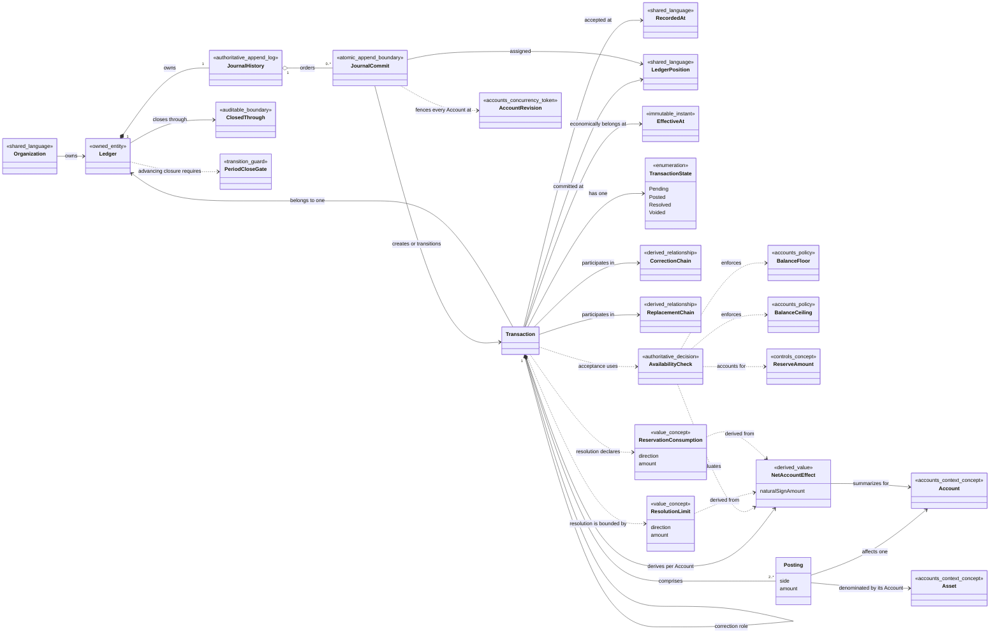

# Journal Model

> Conceptual bounded-context model — not yet implemented

This note is a reference view of the Journal bounded context. The canonical language remains in [[contexts/journal/CONTEXT|Journal Context]], and accepted Journal ADRs remain authoritative for its decisions.

## Class Diagram

Replacement, posted settlement, and continuation are roles played by Transactions connected through explicit links. Transaction Resolution, including partial resolution, is atomic behavior over those links rather than a separate mutable Transaction entity.

## Ledger

An independent accounting book owned by one Organization and scoped by that Organization to a legal entity, product, environment, or another accounting boundary. It owns one Journal History; Accounts and Transactions belong to exactly one Ledger, and a Transaction cannot post across Ledgers.

## Journal History

The authoritative Ledger-partitioned append-only sequence of Journal Commits ordered by Ledger Position. A Transaction's immutable content is introduced exactly once, while later commits may append its lifecycle and relationship facts without rewriting it. Per-Account activity streams, indexes, balance views, and write snapshots are derived from this history.

## Transaction

An indivisible record of monetary activity inside one [[Journal Model#Ledger|Ledger]]. It has at least two strictly positive Postings that balance independently for every Asset and at least one Account with a non-zero [[Journal Model#Net Account Effect|Net Account Effect]]. A [[Journal Model#Journal Commit|Journal Commit]] accepts the complete Transaction as part of one change set at an immutable Ledger Position, after which its Accounts, Assets, amounts, and Postings remain immutable.

The Journal interface accepts and changes Transactions as complete domain operations. It does not expose independent Posting creation, mutation, or deletion.

## Journal Commit

The successful atomic append of one complete Journal change set at one Ledger Position after its Account Revision Fence succeeds. A change set may accept complete Transactions with all their Posting facts and may transition already accepted Transactions through explicit links. Direct acceptance includes one new Transaction; Transaction Resolution includes its original's transition, at least one complete Posted settlement Transaction, and at most one complete Continuation Transaction. The commit records every evaluated Account Revision, and a failure appends none of the change set.

## Account Revision Fence

The Journal Commit condition that every affected Account's current Account Revision still equals the revision whose lifecycle, Asset, Normal Side, and bounds Journal evaluated. Any mismatch invalidates the entire decision for re-evaluation; no Transaction, Posting, link, or lifecycle transition partially appends. The fence is internal and does not require clients to supply Account Revisions.

## Recorded At

The shared immutable service-assigned wall-clock instant when a Transaction was accepted. It may be shared by several committed mutations and does not establish Journal replay or audit order.

## Ledger Position

The immutable service-assigned commit coordinate that totally orders committed mutations within one Ledger. It determines Ledger-local Journal replay and audit order, need not be consecutive or exposed as a number, and may be encoded inside a broader opaque Consistency Position.

## Effective At

The immutable Organization-provided instant when Posted activity economically belongs for reporting. For a Posted Transaction it equals or precedes Recorded At. It never changes Ledger Position, acceptance-time controls, or what the service knew earlier.

## Closed Through

The latest Effective At instant in a Ledger that is closed to new Posted activity. Posting on or before this boundary is rejected; moving it backward requires an explicit authorized reopening with an audit trail.

## Period Close Gate

The conditions required to advance Closed Through: no Pending or Continuation Transaction has Effective At on or before the proposed boundary. Each such commitment must first be Resolved, Voided, or replaced into an open period.

## Transaction State

The lifecycle position Pending, Posted, Resolved, or Voided. Direct final activity is Posted; a Pending Transaction becomes Resolved through linked Posted Transactions or Voided when nothing is posted, and neither terminal state contributes to pending totals.

## Correction Transaction

A new Posted Transaction linked to prior Posted activity that corrects its accounting effect without changing either record.

## Reversal Transaction

A Correction Transaction that exactly negates every Posting of one original Posted Transaction.

## Adjustment Transaction

A Correction Transaction that records a balanced delta when exact reversal is not appropriate.

## Correction Chain

An original Posted Transaction and the ordered Reversal or Adjustment Transactions that directly or indirectly correct it. Its net accounting effect is derived from the complete chain rather than a mutable reversed flag.

## Closed Account Correction

An explicitly authorized Correction Transaction that may reference a Closed Account only when the complete atomic correction leaves that Account at exactly zero with no pending commitment. Any resulting position is transferred to an Open successor or adjustment Account.

## Replacement Transaction

A Transaction role that links a new Transaction to one Voided Pending Transaction whose accounting content needed correction. A Voided Pending Transaction has at most one direct Replacement; changing that successor requires voiding and replacing the successor. The original remains unchanged and auditable.

## Replacement Chain

The derived non-branching sequence formed by direct Replacement links. Each successor references its immediate Voided predecessor. Separate business work may share a Source Reference without belonging to or branching this chain.

## Transaction Resolution

The atomic conclusion of a Pending Transaction in one Journal Commit through at least one linked Posted settlement Transaction. It settles some or all of the commitment and either releases the remainder or carries it into a [[Journal Model#Continuation Transaction|Continuation Transaction]]. The original's transition and every complete new Transaction share the commit's Ledger Position. If nothing settles, the original remains Pending, is Voided, or is Voided and linked to a Replacement Transaction; a zero-settlement operation is not a Transaction Resolution.

### When only part settles

A Transaction Resolution that posts a non-zero settlement for only part of the Pending commitment. Partial resolution is represented by the original, linked Posted settlement Transactions, and an optional Continuation Transaction—not by editing the original or partially posting its Postings.

## Continuation Transaction

A new Pending Transaction created atomically by a Transaction Resolution to carry an unsettled remainder after at least one linked Posted settlement Transaction is created. It has its own identity and links to the Resolved original, allowing repeated partial settlements without mutable Transaction content.

## Resolution Limit

The maximum natural-sign movement in one direction that a Transaction Resolution may consume for an Account and Asset from its Pending Transaction. Each affected Account derives separate decrease and increase Resolution Limits from that Pending Transaction's [[Journal Model#Net Account Effect|Net Account Effect]]; only the effect's direction has a non-zero limit. Linked Posted and Continuation Transactions cannot exceed either directional limit.

## Reservation Consumption

The directional [[Journal Model#Net Account Effect|Net Account Effect]] of a linked Posted or Continuation Transaction claimed from a Pending Transaction by a Transaction Resolution. Decrease and increase consumption are declared separately, and effects from distinct Transactions do not offset. Resolution balancing Postings may use different Accounts, but every movement not covered by Reservation Consumption requires a fresh [[Journal Model#Availability Check|Availability Check]].

## Posting

One debit or credit line within exactly one [[Journal Model#Transaction|Transaction]], against exactly one [[contexts/accounts/Accounts Model#Account|Account]] and therefore one [[contexts/accounts/Accounts Model#Asset|Asset]]. Its amount is strictly positive and its Debit or Credit side carries direction. It is accepted only through its Transaction's Journal Commit and has no independent append, source, destination, lifecycle, or command semantics.

## Net Account Effect

The single natural-sign change derived for one Account by summing every Posting against it within one Transaction. A positive result increases the natural balance, a negative result decreases it, and zero consumes neither directional capacity. An individual Account effect may be zero in an otherwise non-zero Transaction. Net Account Effect is used for capacity and Resolution Limits but never replaces the immutable Postings or offsets an effect from another Transaction.

## No Economic Effect

The stable business rejection returned when valid positive Postings produce a zero Net Account Effect for every Account in a proposed Transaction. No Transaction or Posting is accepted, and the outcome consumes the operation's Idempotency Key under the context-wide Key-Consuming Outcome rule. A zero or negative Posting amount is malformed input and never reaches this decision.

## Over-Ceiling

The authoritative condition in which an Account's position is above its current Balance Ceiling or accepted commitments consume more increasing room than the ceiling permits. New increases are rejected while accepted commitments may resolve and decreases restore compliance.

## Over-Floor

The authoritative condition in which an Account's position is below its current Balance Floor or accepted commitments consume more decreasing room than the floor permits. New decreases are rejected while accepted commitments may resolve and increases restore compliance.

## Availability Check

The atomic decision that evaluates the proposed Transaction's [[Journal Model#Net Account Effect|Net Account Effects]] against every affected Account's configured [[contexts/accounts/Accounts Model#Balance Floor|Balance Floor]] and [[contexts/accounts/Accounts Model#Balance Ceiling|Balance Ceiling]] after authoritative Posted activity, existing Pending Transaction effects aggregated gross by direction, and applicable Reserve Amount effects are considered. Effects from distinct Transactions do not offset. The Transaction reserves capacity for every affected Account or for none.

Availability Check belongs to Journal's authoritative acceptance path. It must not ask an eventually consistent [[contexts/balances/Balances Model#Balance Snapshot|Balance Snapshot]], [[contexts/balances/Balances Model#Decrease Capacity|Decrease Capacity]], or [[contexts/balances/Balances Model#Increase Capacity|Increase Capacity]] projection to authorize a Transaction.

## Cross-Context Coordination

- Accounts supplies Ledger membership, Asset, Normal Side, lifecycle state, Balance Floor, and Balance Ceiling facts with an Account Revision. Journal records those evaluated revisions and fences every affected Account before commit.
- Controls supplies applicable permission and Reserve Amount decisions in one authoritative ordering with Transaction acceptance.
- Journal supplies immutable accepted Transaction and Posting facts from which Balances can rebuild every balance view.
- Journal supplies authoritative Pending and Continuation evidence needed by the Account Closure Gate.
- Source Reference, Recorded At, and idempotency apply through the system-wide rules in [[SHARED-LANGUAGE|Shared Language]]; Journal does not create a separate keyspace.

## Invariants

- Every Transaction belongs to exactly one Ledger and balances debit and credit Postings independently for every Asset involved.
- Each Ledger has one authoritative Journal History that orders complete Journal Commits by Ledger Position. Transaction content is introduced exactly once; per-Account histories and snapshots are derived.
- One Journal Commit atomically appends a complete change set at one Ledger Position. Every newly accepted Transaction includes its complete Posting set, a Posting has no independent append, and failure leaves no partial transition or Account activity.
- Journal Commit succeeds only when every affected Account Revision still matches the evaluated revision. Any mismatch invalidates the whole decision for re-evaluation.
- Every Posting amount is strictly positive; Debit or Credit carries direction. Zero or negative amounts are malformed input.
- For capacity purposes, all Postings against one Account within one Transaction derive exactly one Net Account Effect. Effects from distinct Transactions never offset.
- Every accepted Transaction has at least one non-zero Net Account Effect; an all-zero proposal is rejected with No Economic Effect.
- An accepted Transaction may have zero Net Account Effect for an individual Account; its original Postings remain part of the Transaction.
- Accepted Transaction Accounts, Assets, amounts, and Postings never change. Lifecycle transitions and linked Transactions preserve the original content.
- Every accepted Transaction has exactly one immutable Ledger Position, one immutable service-assigned Recorded At, and one immutable Organization-provided Effective At.
- Ledger Position determines Ledger-local replay and audit order. Recorded At may repeat, and Effective At backdating cannot alter the position or the state evaluated at acceptance.
- New Posted activity on or before the Ledger Closed Through boundary is rejected; reopening closed history is a distinct authorized and audited operation.
- Closed Through advances only after every Pending or Continuation Transaction in the period is Resolved, Voided, or replaced into an open period.
- Posted errors are corrected by append-only Reversal or Adjustment Transactions; accepted records are never edited, deleted, or marked with a mutable reversed flag.
- A Closed Account Correction leaves every referenced Closed Account at exactly zero and creates no pending commitment.
- A Replacement Transaction references one Voided Pending predecessor, which has at most one direct Replacement. Repeated changes form a linear Replacement Chain rather than branching or editing an accepted Transaction.
- A Transaction Resolution concludes its Pending original atomically, creates at least one linked Posted settlement Transaction, and creates at most one Pending Continuation Transaction for a carried remainder. Zero settlement cannot create a Continuation.
- Reservation Consumption uses each linked Posted or Continuation Transaction's Net Account Effect and aggregates those effects gross by direction across Transactions. It cannot exceed either original directional Account-and-Asset Resolution Limit; excess in either direction is a separate Transaction subject to current Controls and a fresh Availability Check.
- Resolution balancing Postings need not proportionally copy the original Pending Postings, but every uncovered decrease or increase requires a fresh Availability Check.
- Balance Floors and Balance Ceilings are enforced atomically across all affected Accounts. Reserve Amount affects capacity; Prohibit Action and Usage Limit remain independent permission decisions.
- An Over-Floor or Over-Ceiling Account may move only in the direction that restores compliance, apart from resolving accepted commitments.
- Eventually consistent Balances projections never participate in authoritative Transaction acceptance.

## Unresolved Questions and Overstatement Risks

- ADR 0005 says a Pending Transaction may become Posted or Voided, while the newer glossary and ADR 0006 use Resolved or Voided for Pending conclusions. This note follows the newer resolution model.
- Timestamp precision and time-zone representation are not specified.
- The authorization policy and accounting process for reopening a Closed Through period are not yet modeled.
- Journal History fixes the logical Ledger partition and Journal Commit order. The initial implementation uses one shared ACID write transaction; physical tables, segments, shards, and applicable Controls coordination remain undesigned.
- No association in this note implies an aggregate root, storage schema, consistency boundary, deployment boundary, or event-stream topology.

## Related

- [[contexts/accounts/Accounts Model|Accounts Model]]
- [[contexts/balances/Balances Model|Balances Model]]
- [[contexts/journal/CONTEXT|Journal Context]]
- [[SHARED-LANGUAGE|Shared Language]]
- [[docs/adr/0014-split-ledger-into-accounting-contexts|Split Ledger into Accounting Contexts]]
- [[docs/adr/0004-balance-transactions-per-asset|Balance Transactions per Asset]]
- [[docs/adr/0013-separate-directional-capacity-from-operation-permission|Separate Directional Capacity from Operation Permission]]
- [[docs/adr/0009-use-cqrs-and-event-sourced-write-models|Use CQRS and Event-Sourced Write Models]]
- [[docs/adr/0019-separate-ledger-position-from-recorded-time|Separate Ledger Position from Recorded Time]]
- [[docs/adr/0020-fence-journal-commits-with-account-revisions|Fence Journal Commits with Account Revisions]]
- [[docs/adr/0021-co-locate-accounts-and-journal-writes-initially|Co-locate Accounts and Journal Writes Initially]]
- [[contexts/journal/docs/adr/0004-enforce-availability-atomically|Enforce Availability Atomically]]
- [[contexts/journal/docs/adr/0005-keep-accepted-transaction-content-immutable|Keep Accepted Transaction Content Immutable]]
- [[contexts/journal/docs/adr/0006-resolve-pending-with-linked-posted-transactions|Resolve Pending with Linked Posted Transactions]]
- [[contexts/journal/docs/adr/0007-require-a-fresh-check-for-overcapture|Require a Fresh Check for Overcapture]]
- [[contexts/journal/docs/adr/0008-allow-resolution-balancing-postings-to-differ|Allow Resolution Balancing Postings to Differ]]
- [[contexts/journal/docs/adr/0027-net-opposing-postings-within-a-transaction|Net Opposing Postings Within a Transaction]]
- [[contexts/journal/docs/adr/0028-commit-complete-transactions-atomically|Commit Complete Transactions Atomically]]
- [[contexts/journal/docs/adr/0029-partition-journal-history-by-ledger|Partition Journal History by Ledger]]
- [[contexts/journal/docs/adr/0013-separate-recorded-and-effective-time|Separate Recorded and Effective Time]]
- [[contexts/journal/docs/adr/0016-do-not-post-future-effective-activity|Do Not Post Future-Effective Activity]]
- [[contexts/journal/docs/adr/0017-close-ledgers-by-effective-time|Close Ledgers by Effective Time]]
- [[contexts/journal/docs/adr/0020-keep-closed-accounts-at-zero-during-corrections|Keep Closed Accounts at Zero During Corrections]]
- [[contexts/controls/Controls Model|Controls Model]]
