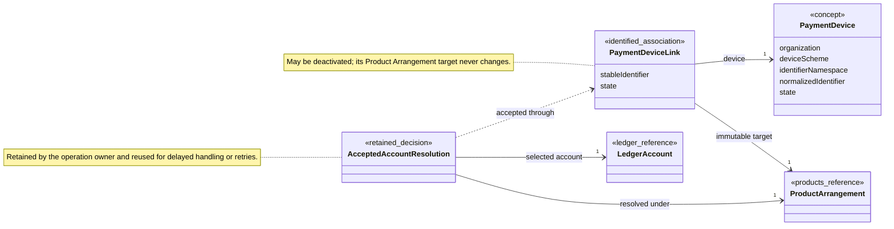

# Payment Instruments Model

> [!status]
> Conceptual model — not yet implemented.

This note is a reference view of the documented Payment Instruments model. It shows only relationships established by the context language and its decisions; it is not a code or persistence design.

## Class Diagram

Each Payment Device Link connects one Payment Device to one Product Arrangement. A Payment Device may retain many historical Links but has at most one Active Link; the reverse cardinality from Product Arrangement is not specified.

## Concept Reference

### Payment Device

An instrument or address used to initiate or direct a payment, such as a card or IBAN. Its immutable identity combines Organization, Device Scheme, Identifier Namespace, and normalized identifier; it is neither a Product Arrangement nor a Ledger Account.

### Device Scheme

The kind of Payment Device identifier and the validation and normalization rules for that kind, such as IBAN, Card Token, or Tag.

### Identifier Namespace

The authority or domain within which a normalized Payment Device identifier is unique.

### Payment Device State

Active permits new activity. Retired is terminal, prospectively deactivates the Active Link, and leaves already accepted operations able to finish under their retained decisions.

### Payment Device Link

A first-class association with its own stable identifier. It connects one Payment Device to one immutable target Product Arrangement, may be deactivated, and is never retargeted. Its identity is distinct from both the Payment Device identifier and the Product Arrangement identifier.

### Product Arrangement Reference

Product Arrangement is an external concept owned by the Products context. Payment Instruments retains the Link to the arrangement without deciding which assigned Ledger Account an operation uses.

### Accepted Account Resolution

For an accepted operation, the rules of the target Product Arrangement's bound Product Definition resolve the operation purpose and Asset to one assigned Ledger Account. The operation owner retains that exact result, so delayed handling and retries do not repeat resolution against possibly changed Assignments.

### Ledger Account Reference

Ledger Account is an external concept owned by the Accounts context. It is the retained result of accepted-operation resolution, not the Payment Device Link target.

## Invariants

- Every Payment Device Link references exactly one Payment Device.
- Every Payment Device Link references exactly one target Product Arrangement.
- The target Product Arrangement is immutable for the lifetime of the Link.
- A Payment Device has at most one Active Link but may retain many Inactive historical Links.
- Reassignment is represented by deactivating the old Link and creating a new Link.
- A Link's identity is distinct from the identities of both objects it connects.
- Every accepted operation resolves to exactly one Ledger Account assigned to the Link's target Product Arrangement.
- The accepted Ledger Account resolution is retained and reused for every retry or delayed continuation of that operation.
- Accounts and Journal remain unaware of Payment Device semantics.

## Unresolved Cardinalities and Overstatement Risks

- The reverse multiplicity from Product Arrangement to Payment Device Link and the maximum number of historical Links for one Payment Device are unspecified.
- Deactivation metadata and Product-Arrangement-reference representation are unspecified.
- The operation owner and the representation of Accepted Account Resolution are not selected here.
- Product rules define resolution by operation purpose and Asset; the complete purpose catalogue and failure behavior for a missing or ambiguous Ledger Account Assignment remain Products concerns.
- The documentation does not yet establish aggregate, event-stream, persistence, or transaction boundaries.
- Do not infer that a Payment Device is a Product Arrangement or Ledger Account, that a Link conveys ownership, or that the Link may be edited to point elsewhere.

## Related

- [[Domain Model Index]]
- [[CONTEXT-MAP|Context Map]]
- [[docs/adr/0012-route-customer-facing-relationships-through-product-arrangements|Route Customer-Facing Relationships Through Product Arrangements]]
- [[contexts/payment-instruments/CONTEXT|Payment Instruments Context]]
- [[contexts/payment-instruments/docs/adr/0002-link-devices-to-arrangements-and-retain-account-resolution|Link Devices to Arrangements and Retain Account Resolution]]
- [[contexts/products/Products Model|Products Model]]
- [[contexts/payment-instruments/docs/adr/0001-keep-link-account-targets-immutable|ADR — Keep Link Account Targets Immutable]]
- [[docs/adr/0005-separate-payment-instruments-from-ledger|ADR — Separate Payment Instruments from Ledger]]
- [[contexts/accounts/Accounts Model|Accounts Model]]
- [[contexts/journal/Journal Model|Journal Model]]
- [[Controls Model]]
