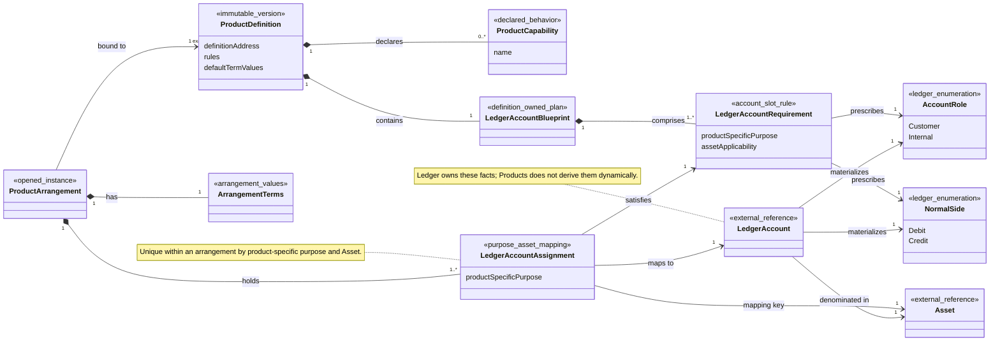

# Products Model

> [!status]
> Conceptual model — not yet implemented.

This note is a navigable reference for the current Products language and decisions. It describes product semantics and cross-context relationships, not storage ownership, aggregate boundaries, event streams, or implementation classes.

## Class Diagram

The Product Definition describes what should be opened. The Product Arrangement records what was opened, and each Ledger Account Assignment connects a product-specific purpose and concrete Asset to the Ledger Account that realizes it.

## Product Definition

An immutable, version-addressed specification of one offered product shape. Its rules, declared Product Capabilities, Ledger Account Blueprint, and default term values are fixed together so an arrangement can identify the exact semantics under which it was opened.

Publishing changed rules means publishing another Product Definition. A label such as Everyday Account, Multi-currency Account, or Credit Account may identify an offering to people, but it does not classify a Ledger Account.

## Product Capability

A named behavior made available by a Product Definition. Examples may include Payments, Cash Withdrawal, Currency Holding, Overdraft Access, or Credit Drawdown; the catalogue and granularity are not yet fixed.

A capability is declarative product scope. It does not authorize an individual operation, override a Control, or replace a Ledger invariant.

## Ledger Account Blueprint

The Product Definition-owned description of the Ledger Account structure that arrangements of that definition require. It comprises one or more Ledger Account Requirements.

The blueprint is a prescription, not a collection of live Accounts. It can describe a fixed-Asset requirement or a requirement repeated for each Asset selected for an arrangement.

## Ledger Account Requirement

One account slot identified by a product-specific purpose and its Asset applicability. It prescribes the Account Role and Normal Side that a satisfying Ledger Account must materialize and whether the Account uses a Balance Floor, Balance Ceiling, or no bound; Arrangement Terms supply permitted concrete bound values.

Examples of product-specific purposes might include available funds, credit receivable, fee income, or interest receivable. These purposes belong to Products; they do not become classifications inside Ledger.

## Product Arrangement

An opened instance bound to one exact Product Definition. It holds the actual Arrangement Terms and the Ledger Account Assignments that realize the bound definition for concrete Assets.

Creating a newer Product Definition does not silently move an existing Product Arrangement. Adoption of another definition requires an explicit migration whose historical binding and effects remain observable.

## Arrangement Terms

The concrete term values governing one Product Arrangement. They begin from the bound definition's defaults and include only selections or overrides allowed by that exact definition.

This model does not yet specify whether terms can later be amended or the temporal representation needed if they can. Whatever amendment model is chosen must not rewrite the terms under which earlier activity occurred.

## Ledger Account Assignment

A mapping within one Product Arrangement from a product-specific purpose and one concrete Asset to one external Ledger Account. It satisfies the corresponding Ledger Account Requirement only when the Account has that Asset, prescribed Account Role and Normal Side, and the balance-bound policy required by the Arrangement Terms.

For an accepted product operation, Products resolves the operation's purpose and Asset through the arrangement's Ledger Account Assignment to one Ledger Account. The owner of that accepted operation retains the resolved Account and reuses it for retries; a retry does not resolve again against newer arrangement state.

The model does not yet decide whether an Assignment can be replaced for future operations. Any such replacement must leave earlier accepted-operation resolutions and Ledger history unchanged.

## Ledger Materialization Boundary

The Ledger Account Blueprint prescribes Account Role and Normal Side, but Ledger materializes both as facts of the Account when it is created. Ledger balance calculation and historical interpretation use those materialized facts, not a current Product Definition lookup.

Consequently, publishing a new Product Definition or explicitly migrating a Product Arrangement cannot reinterpret an existing Account's Normal Side, Asset, prior Postings, or derived balances. A migration that needs different accounting facts provisions and assigns suitable Accounts instead of mutating historical facts.

## Multi-currency Arrangements

A Ledger Account has exactly one immutable Asset. A multi-currency Product Arrangement therefore realizes an Asset-applicable Ledger Account Requirement with a distinct Ledger Account Assignment and a distinct single-Asset Ledger Account for each selected Asset.

For example, `available funds + EUR` and `available funds + USD` map to different Accounts. The Product Arrangement provides the multi-currency grouping; no Ledger Account becomes multi-Asset.

## Credit Product Shapes

Credit products use one of two explicit accounting and exposure-enforcement shapes:

- An overdraft can use a credit-normal deposit or stored-value Account whose position may fall below zero. A Ledger Balance Floor can express the permitted negative extent.
- A loan or card receivable uses a debit-normal receivable Account whose increasing positive position represents exposure. A Ledger Balance Ceiling caps that growth atomically during Transaction acceptance.

These shapes are not interchangeable. A Product Definition and its Ledger Account Blueprint select an explicit shape; Ledger owns and atomically enforces the resulting Balance Floor or Balance Ceiling, while Arrangement Terms supply permitted product-specific values.

## Invariants

- Every Product Definition is immutable and has an exact version address.
- Every Product Arrangement is bound to the exact Product Definition under which it operates; a later definition does not affect it implicitly.
- Every Product Arrangement has Arrangement Terms allowed by its bound Product Definition.
- A Ledger Account Blueprint comprises Ledger Account Requirements that prescribe Account Role, Normal Side, and the applicable Balance Floor, Balance Ceiling, or unbounded shape; it does not own live Ledger Accounts.
- Within a Product Arrangement, product-specific purpose plus Asset identifies at most one current Ledger Account Assignment.
- Every Ledger Account Assignment references one concrete Asset and one external Ledger Account with the same Asset.
- An assigned Ledger Account materializes the Account Role, Normal Side, and current balance-bound policy prescribed by its Ledger Account Requirement and Arrangement Terms.
- Multi-currency arrangements use a distinct single-Asset Ledger Account for each assigned Asset; Products supplies the grouping.
- A credit Product Definition selects an overdraft Balance Floor or receivable Balance Ceiling shape; Ledger atomically enforces the resulting Account bound.
- Accepted product operations retain their resolved Ledger Account for retries rather than re-resolving against changed arrangement state.
- Product Definition publication and Product Arrangement migration never reinterpret existing Account facts, accepted-operation resolutions, Postings, or balances.
- Moving an arrangement to another Product Definition is explicit and preserves the prior definition binding as history.
- A Product Capability declares supported product behavior but does not itself grant operational permission or weaken Ledger and Controls decisions.
- Customers owns Stakeholder relationships to Product Arrangements; Products does not identify the Customers who are parties to an Arrangement.

## Unresolved Questions and Overstatement Risks

- The Product Capability catalogue, naming, and granularity are not yet specified.
- Stable product-line identity across Product Definition versions, and definition publication, withdrawal, and deprecation lifecycles, are not yet modeled.
- The allowed Arrangement Terms, override rules, amendment lifecycle, and temporal semantics are not yet specified.
- Fixed, optional, conditional, and per-selected-Asset Ledger Account Requirement cardinalities need a concrete rule representation.
- Product Arrangement opening and Ledger Account provisioning may need atomic coordination, but no consistency mechanism is selected.
- Ledger Account Assignment replacement, activation, and migration mechanics are not specified.
- The operation-owning context retains accepted-operation Account resolution; retention representation and duration are not specified here.
- No association in this note implies an aggregate root, persistence schema, event-stream topology, or distributed transaction boundary.

## Related

- [[CONTEXT-MAP|Context Map]]
- [[contexts/products/CONTEXT|Products Context]]
- [[docs/adr/0011-separate-products-from-ledger|Separate Products from Ledger]]
- [[docs/adr/0012-route-customer-facing-relationships-through-product-arrangements|Route Customer-Facing Relationships Through Product Arrangements]]
- [[contexts/products/docs/adr/0001-bind-arrangements-to-immutable-product-definitions|Bind Arrangements to Immutable Product Definitions]]
- [[contexts/accounts/CONTEXT|Accounts Context]]
- [[contexts/journal/CONTEXT|Journal Context]]
- [[contexts/balances/CONTEXT|Balances Context]]
- [[contexts/accounts/Accounts Model|Accounts Model]]
- [[contexts/journal/Journal Model|Journal Model]]
- [[contexts/customers/Customers Model|Customers Model]]
- [[contexts/payment-instruments/Payment Instruments Model|Payment Instruments Model]]
- [[contexts/controls/Controls Model|Controls Model]]
