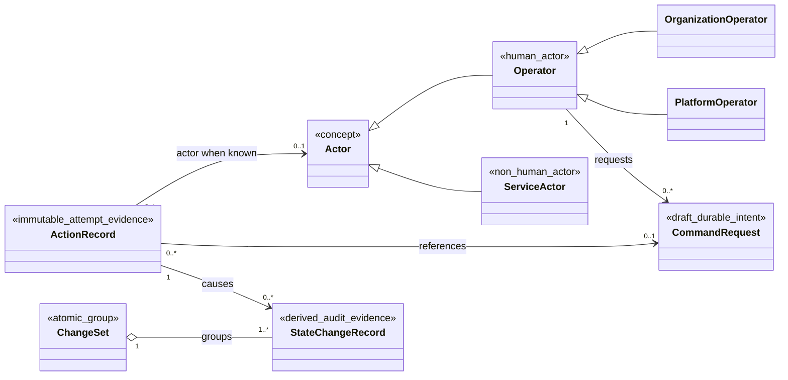
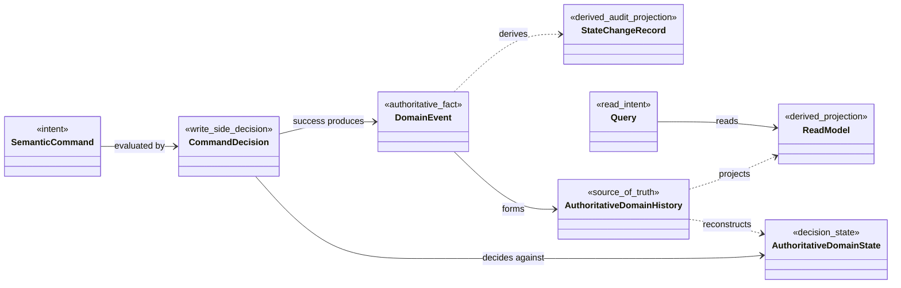

# Audit And Command Model

> Draft conceptual model — not assigned to a bounded context; not implemented.
>
> **Snapshot:** 2026-07-11

This note conservatively visualizes concepts from the draft Ledger Service feature specification together with the accepted CQRS and event-sourcing constraints in ADR 0009. It is a discussion aid, not an implementation design, persistence schema, event contract, or claim of context ownership.

## Source Authority

- The Actor, Command Request, Audit Trail, Action Record, State Change Record, and Change Set concepts come from the draft feature specification. Their names, lifecycle, fields, and ownership may still change.
- Accepted [[docs/adr/0009-use-cqrs-and-event-sourced-write-models|ADR 0009]] is authoritative for separating commands from queries, using Domain Events as authoritative history, and treating read models and State Change Records as rebuildable derivatives.
- The canonical [[CONTEXT-MAP|Context Map]] currently contains Ledger, Customers, Payment Instruments, and Controls only. This note deliberately does not invent an Audit, Operations, Identity, or Command bounded context.

## Actor Hierarchy and Audit Causality

The multiplicities express only requirements already stated by the draft specification:

- An Actor is either an Operator or a Service Actor. Operator is specialized as Organization Operator or Platform Operator. An Action Record may have no identified Actor when authentication fails.
- A Command Request is durable semantic intent submitted by an Operator. The draft lifecycle is Pending Approval, Approved, Rejected, Executing, Executed, Failed, Cancelled, or Expired; these states are not yet canonical domain language.
- Exactly one Action Record records each externally visible operation attempt and each system execution attempt, including reads, rejections, failures, authorization failures, and idempotent replays.
- One Action Record causes zero or more State Change Records, and every State Change Record has exactly one causing Action Record. Reads and attempts that commit no new domain transition therefore have zero State Change Records.
- A Change Set groups the State Change Records committed together. The diagram does not assert how Change Sets are identified, stored, or owned.

## CQRS and Event-Sourcing Constraints

- Semantic commands are decided against authoritative state, never against an eventually consistent query projection.
- A successful mutation atomically preserves its Domain Events, idempotency outcome, completed Action Record, and the audit-safe information needed to materialize State Change Records.
- Each Ledger owns one authoritative Journal History ordered by Ledger Position. Journal Commit atomically appends one complete change set; every new Transaction includes its full Posting set, no Posting is independently accepted, and failure creates no partial transition or Account activity.
- The initial implementation uses one ACID write transaction across Accounts and Journal to record and fence every evaluated Account Revision, append the complete Journal Commit, and preserve its idempotency and audit outcome; a mismatch invalidates the entire Transaction decision for re-evaluation.
- Reads and rejected or failed commands create an Action Record but append no Domain Event and create no State Change Record.
- Domain Events form authoritative domain history. A State Change Record is derived from Domain Events and is not a source of truth; it is a rebuildable, searchable audit representation rather than a second history of domain state.
- Read models are rebuildable projections. A successful command returns a committed consistency position, while a query result exposes the position through which it is current.
- The diagram deliberately stops at authoritative history. It makes no aggregate claim and assigns no event-stream, stream-topology, storage, or consistency-boundary design; ADR 0009 explicitly defers the exact Ledger topology.

## Terminology Drift to Resolve

| Area | Canonical model and decisions | Draft specification wording | Conservative treatment |
|---|---|---|---|
| Asset / currency | Ledger defines **Asset** as the general denomination; fiat currency is one Asset kind. | Stories, filters, views, and key entities still often say currency. | Use Asset for domain rules and use currency only when a requirement intentionally means a fiat Asset. |
| Account Role + Normal Side / product type | Account Role and immutable Normal Side are independent Ledger dimensions. Debit and Credit describe natural accounting direction, not Product types. | FR-001 now requires both dimensions; older downstream material may still use Account Classification or generic account type. | Use `normalSide` with exactly Debit or Credit. Reserve Everyday Account, Multi-currency Account, and Credit Account for the Products context. |
| Multi-Asset / single-currency assumption | ADR 0004 permits one Transaction to contain multiple Assets when it balances independently per Asset; one Account still has exactly one Asset. | Some draft wording still assumes a Transaction is single-currency. | Treat supported Assets as a Product Definition rule, not a Ledger invariant. A Multi-currency Product Arrangement coordinates several single-Asset Accounts. |
| Product boundary | Products owns Product Definitions, Product Arrangements, terms, capabilities, and Ledger Account requirements. Ledger owns Accounts, Postings, balances, and accounting invariants. | This draft is a Ledger Service feature and does not specify product opening or servicing operations. | Do not add Product fields, types, or endpoints to the Ledger contract; product workflows express their monetary effects through Ledger primitives. |
| Ledger Entry ambiguity | Canonical Ledger language models Transaction and Posting; Posting explicitly avoids the synonym ledger entry. | The draft defines Ledger Entry as the immutable accepted record of a Transaction and its Postings. | Prefer Transaction and Posting. If Ledger Entry remains, define it explicitly as an alias or read representation rather than a new authoritative entity. |
| Lifecycle states | Account State is Open, Closing, or Closed. Closing drains accepted commitments before a zero-balance, no-pending closure gate; temporary blocks belong to Controls. | The draft names Active, Inactive, and Closed for Accounts and a separate eight-state Command Request lifecycle. | Revise Account requirements to use the canonical lifecycle and keep the Command Request lifecycle draft-only until its owning context is resolved. Never model a temporary freeze as Account lifecycle. |
| Position / recorded / effective / known time | Accepted Transactions have immutable Ledger Position, Recorded At, and Effective At values. Ledger Position determines Ledger-local replay and audit order; Recorded At is wall-clock metadata and may repeat. Posted activity cannot be future-effective. Historical Point-in-Time Balance uses Effective At plus at most one knowledge cutoff: Known At by wall-clock time or Known Through by Ledger Position. Balance Snapshot reports current operational state. | The draft commonly uses business date, recorded timestamp, current balance, and as-of balance without the canonical ordering and bitemporal distinction. | Map business date to Effective At only where that meaning is intended. Use Ledger Position for audit order, keep Recorded At as wall-clock evidence, expose Known At or Known Through for reproducible historical queries, and do not mix pending or directional capacity data into Point-in-Time Balance. |
| Correction / Replacement | Accepted Transaction content is immutable. Replacement Transaction is canonical for replacing a Voided Pending Transaction through a linked new Transaction. | Correction Entry means a separate reversal or adjustment for accepted ledger activity. | Keep replacement and posted-activity correction distinct. The reversal/adjustment workflow still needs canonical terminology and invariants; neither workflow edits the original. |
| Context ownership | Context Map assigns Accounts, Journal, Balances, Products, Customers, Payment Instruments, and Controls. | The draft places Actor, Command Request, Action Record, State Change Record, and Change Set inside a Ledger Service feature. | Leave these concepts unassigned until a context-boundary decision is made; this note is not that decision. |
| Source Reference / retry identity | Source Reference correlates related operations and may repeat. Retry identity is the pair of client Idempotency Namespace and Idempotency Key. Accepted outcomes and stable business rejections consume a key; malformed, authentication, authorization, and temporary failures do not, and a consumed binding is not reused. | FR-008 and retry scenarios treat Source Reference as the uniqueness or replay identity; Command Request uses a generic idempotency identity. | Retain Source Reference for business correlation and revise retry rules to use the canonical namespace-and-key identity. Do not assume the Command Request identity and Ledger operation key are the same without a separate decision. |

## Related

- [[Domain Model Index]]
- [[specs/001-ledger-service/spec|Ledger Service Feature Specification]]
- [[CONTEXT-MAP|Context Map]]
- [[docs/adr/0009-use-cqrs-and-event-sourced-write-models|ADR 0009 — Use CQRS and Event-Sourced Write Models]]
- [[docs/adr/0019-separate-ledger-position-from-recorded-time|ADR 0019 - Separate Ledger Position from Recorded Time]]
- [[contexts/accounts/CONTEXT|Accounts Context]]
- [[contexts/journal/CONTEXT|Journal Context]]
- [[contexts/balances/CONTEXT|Balances Context]]
- [[SHARED-LANGUAGE|Shared Language]]
- [[docs/adr/0014-split-ledger-into-accounting-contexts|Split Ledger into Accounting Contexts]]
- [[docs/adr/0015-separate-source-reference-from-idempotency|Separate Source Reference from Idempotency]]
- [[docs/adr/0016-use-one-idempotency-namespace-per-client|Use One Idempotency Namespace per Client]]
- [[docs/adr/0017-persist-stable-idempotent-outcomes|Persist Stable Idempotent Outcomes]]
- [[docs/adr/0018-never-reuse-consumed-idempotency-keys|Never Reuse Consumed Idempotency Keys]]
- [[contexts/journal/docs/adr/0013-separate-recorded-and-effective-time|Separate Recorded and Effective Time]]
- [[contexts/balances/docs/adr/0014-support-bitemporal-balance-queries|Support Bitemporal Balance Queries]]
- [[contexts/balances/docs/adr/0015-separate-historical-balance-from-operational-snapshot|Separate Historical Balance from Operational Snapshot]]
- [[contexts/journal/docs/adr/0016-do-not-post-future-effective-activity|Do Not Post Future-Effective Activity]]
- [[contexts/journal/docs/adr/0017-close-ledgers-by-effective-time|Close Ledgers by Effective Time]]
- [[contexts/accounts/docs/adr/0018-use-closing-state-to-drain-accounts|Use Closing State to Drain Accounts]]
